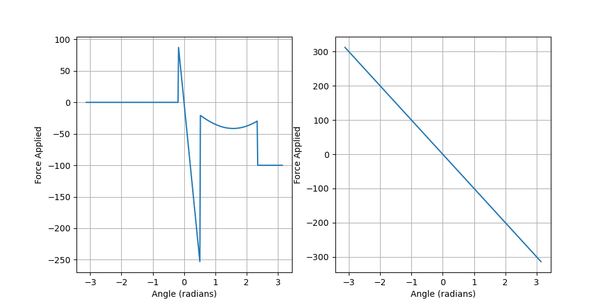
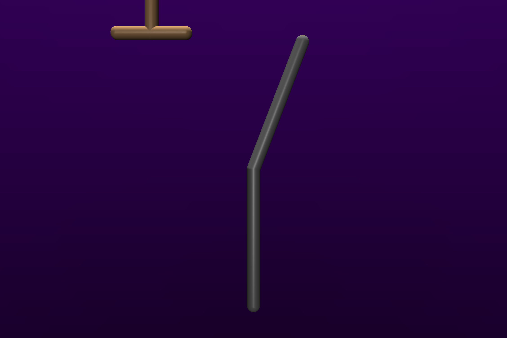
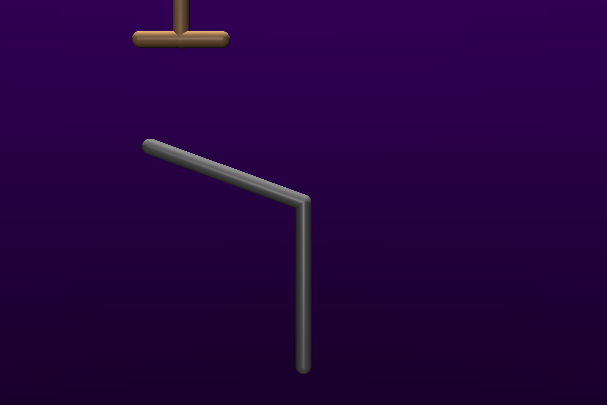
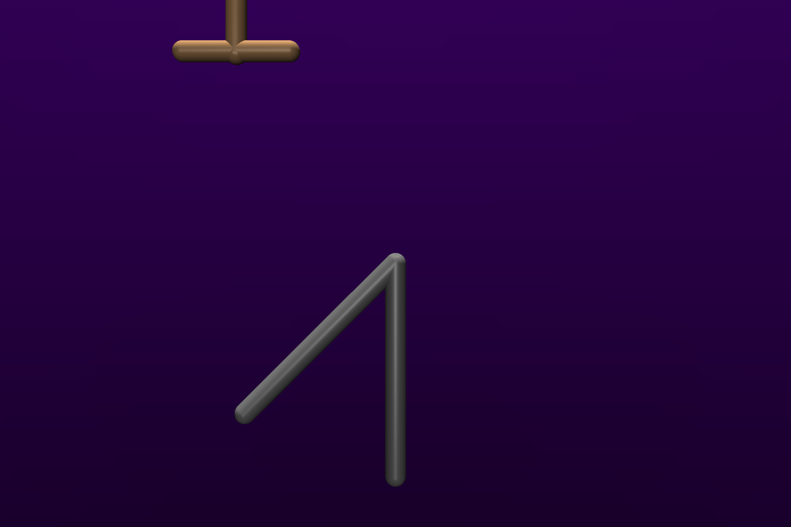
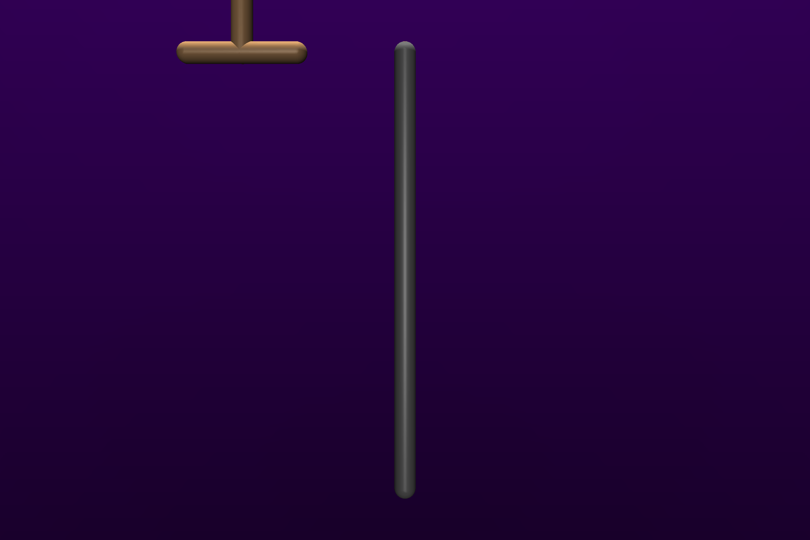

# Mujoco Nonlinear Passive Joint Example

(ChatGPT helped generate the README).

This repository provides a demonstration of how to set nonlinear passive joint properties in mujoco. This can be useful for accurately modeling the behavior of joints that do not follow a linear relationship between torque and angle, such as those with elastic or damping characteristics that change with displacement or velocity.

## Table of Contents

- [Nonlinear Passive Joint Properties](#nonlinear-passive-joint-properties)
  - [Table of Contents](#table-of-contents)
  - [Getting Started](#getting-started)
    - [Installation](#installation)
    - [Usage](#usage)

## Getting Started

### Installation

Clone the repository to your local machine:

```bash
git clone https://github.com/JedMuff/nonlinear-passive-joint-properties.git
cd nonlinear-passive-joint-properties
```

Install the required Python packages:

```pip install -r requirements.txt```

### Usage
The main script to demonstrate setting nonlinear passive joint properties is demo.py. You can run it as follows:
```python demo.py```


<br>






